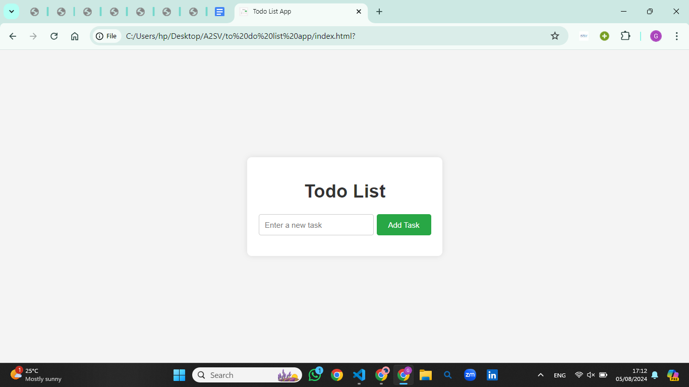
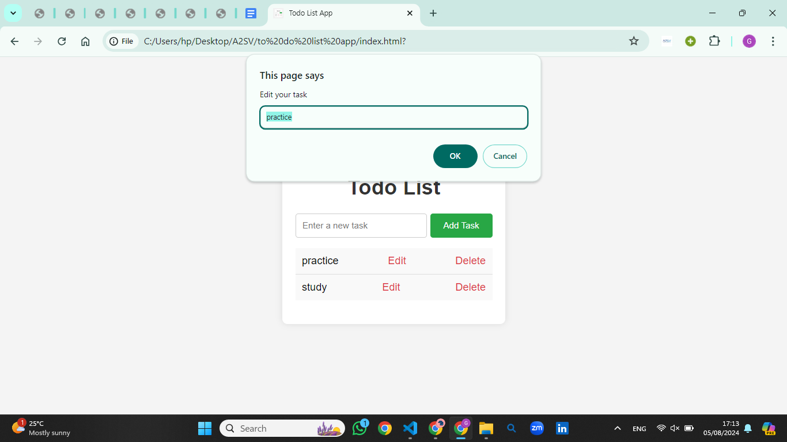

# Todo List Application
This is a simple Todo List application built with HTML, CSS, and JavaScript. It allows users to add, edit, and delete tasks.

## Features
- Add tasks
- Edit tasks
- Delete tasks

## Instructions

# Open `index.html` in your browser to use the application.

## Screenshots

### Home Page

**Description**: This is the main page of the Todo List application where users can add their tasks.

### Editing a Task

**Description**: This screenshot shows the process of editing an existing task by clicking the "Edit" button and entering a new task description.
